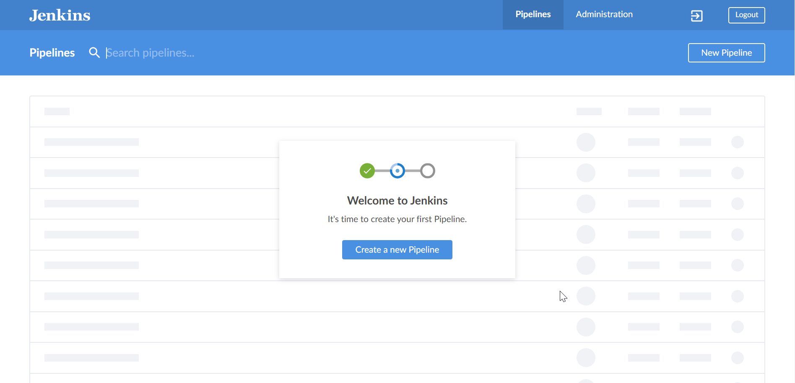
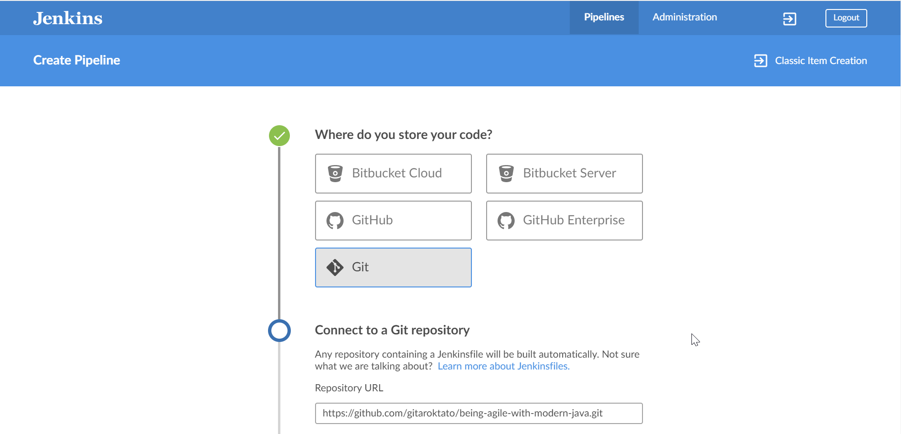
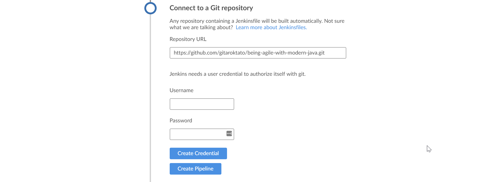
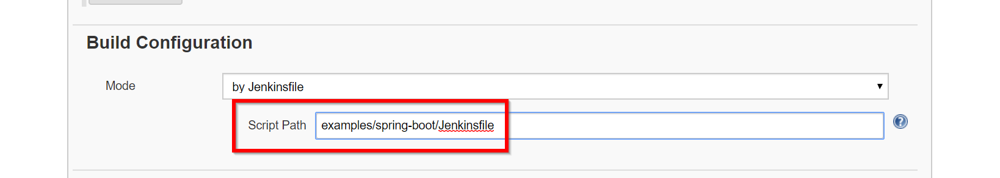
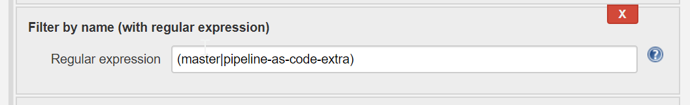

# Being agile with modern Java examples

## How to run the example project?
Go to the `examples/jenkins-cicd` folder

**TIP:** If DNS is not configured properly, you might need to uncomment `dns:` parameter from docker-compose.yml

Bring up CI/CD environment with
```
docker-compose up -d
```

Get the initial admin password by running
```
docker-compose exec jenkins-blueocean sh -c 'cat /var/jenkins_home/secrets/initialAdminPassword'
```

Go to `http://<DOCKER_HOST>:8080/blue` and enter the password from previous step

Set up a new project from scratch. You don't need username and password, just press the "Create Pipeline" button.




Make sure, that you change the parent folder to `examples/spring-boot`


Restrict the scanned branches if you want

